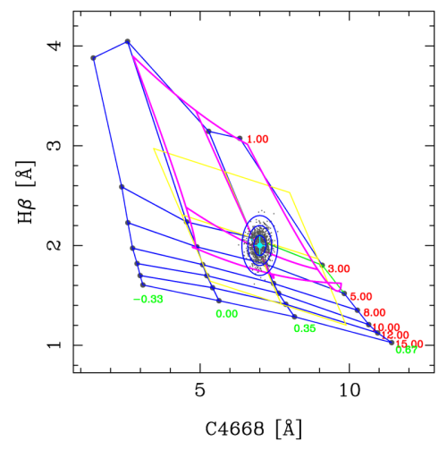

.. rmodel documentation master file, created by
   sphinx-quickstart on Thu Dec 29 13:44:56 2016.
   You can adapt this file completely to your liking, but it should at least
   contain the root `toctree` directive.

Welcome to rmodel's documentation!
==================================

**rmodel** is a program written in Fortran 77 that determines stellar
population parameters (e.g. age, metallicity, IMF slope,...), using as input
line-strength indices, through the interpolation in SSP model predictions. Both
linear and bivariate fits are computed to perform the interpolation, as
explained in `Cardiel et al. (2003)
<http://cdsads.u-strasbg.fr/abs/2003A%26A...409..511C>`_.

The program was created by the author to carry out these kind of
interpolations, in an interactive way, for his own work. Since some colleagues
have asked to use it, the program has been made public through this web page.
The program was not intended to be quite general nor to do much more apart from
the interpolations themselves.

Sometimes the program's output can be overwhelming. Keep in mind that rmodel
has been built as the workbench of many tests concerning interpolations in
index-index diagrams. Many users can ignore much of the information displayed.

Although the program can be executed in scripts, it is quite risky to make use
of the results obtained automatically (i.e., in a non interactive mode), since
the interpolations only make sense when the SSP grid is well behaved (non
degenerate).

.. toctree::
   :maxdepth: 2

   installation
   license_agreement
   the_ssp_model_predictions
   using_the_program
