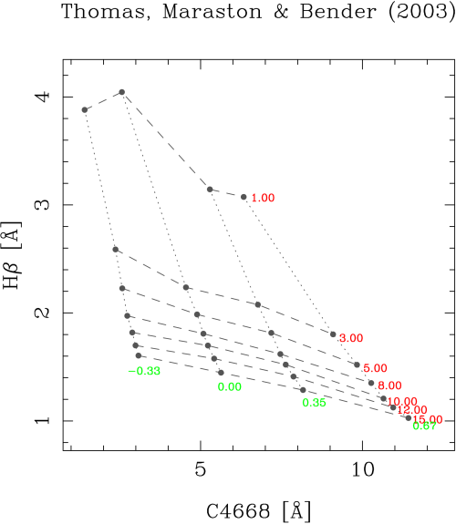
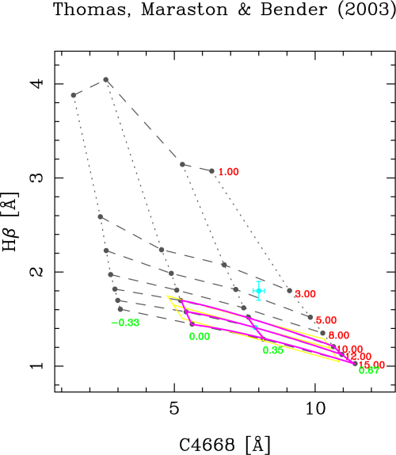
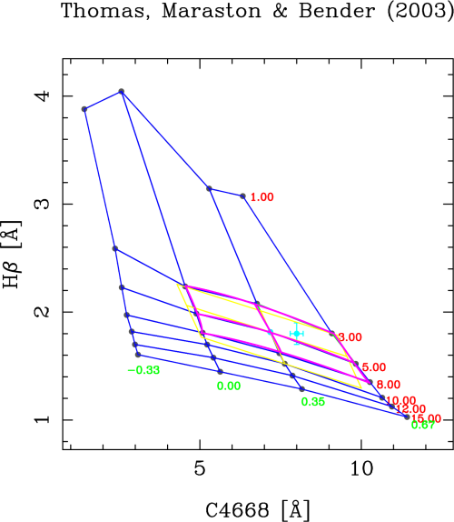
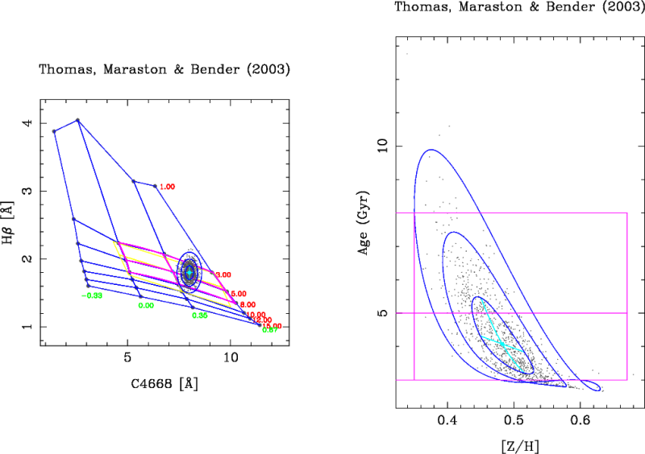
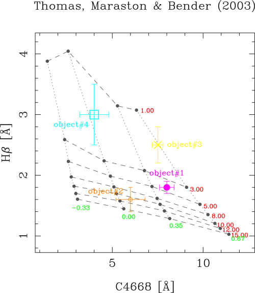
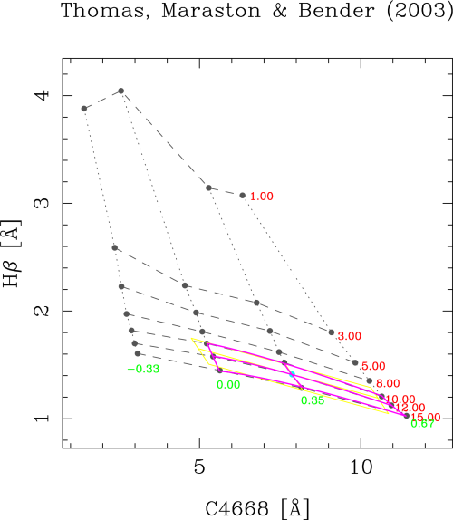
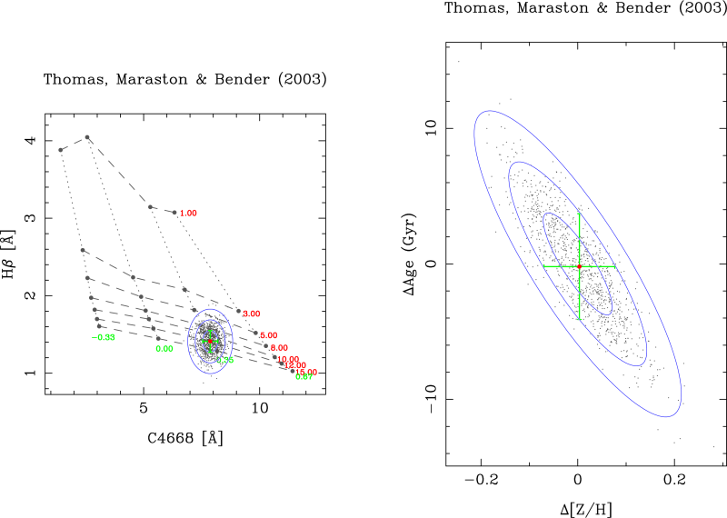
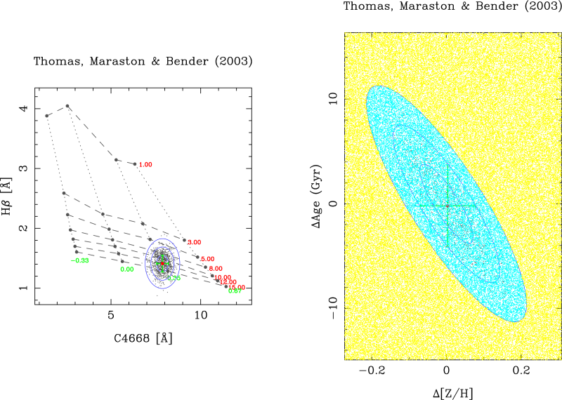

Using the program
=================

Setting the SSP model and indices
---------------------------------

After including rmodel in the user's path, the program can be executed just by
typing its name in the command line

::

   $ rmodel

::

   *******************************************************************************
                          Welcome to Rmodel (version 3.2.3)
   -------------------------------------------------------------------------------
          For more information visit: https://github.com/nicocardiel/rmodel
   *******************************************************************************

   Graphics device/type (? to see list, default /XServe): [RETURN]
   Previous log file (<CR>=none)? [RETURN]

(Note that by hitting "return" the program accepts the defaults shown within
brackets).

The first line requests the graphics device. If the environment variable
``PGPLOT_DEV`` has been properly set (in the above example it was assumed that
such variable has been set set to /XServe) it is enough to hit return.
Otherwise the user must provide the graphics device identification (after
introducing "?" the program displays again the same question; answer again "?"
to get a list with the available graphics devices). After selecting /XServe, a
PGPLOT Window must appear (if the user selects a postscript file, the program
will work without displaying anything).

The second line asks for a previous log file. A log file is automatically
generated each time the program is executed. At the end, the user can decide to
keep that log with a determined file name. This log file can be used later to
repeat the execution of the program. This option is explained in more detail
below.

Next, a list with all the available SSP models must appear:

::

   ===============================================================================
   Model#000: NONE (file model_user.def not found)
   Model#001: Bruzual & Charlot (2001)
   Model#002: Bruzual & Charlot (2003)
   Model#003: Lee & Worthey (2005)
   Model#004: Thomas, Maraston & Bender (2003)
   Model#005: Vazdekis (2006)
   -------------------------------------------------------------------------------
   Model#101: Vazdekis (2009) MILES for KU and LIS-14.0
   ===============================================================================
   Model number (q=QUIT)? 4

Note that the first entry in the list of models (Model#000) is reserved for
model predictions defined by the user, as explained previously. In that case,
the text string appearing in the first line of the file model_user.def will be
shown here.

In the example we are choosing the model predictions of
Thomas_Maraston_Bender_2003_. These models are computed with three free
parameters: age, [Z/H] and [alpha/Fe]. In addition, some predictions are also
available for different [alpha/Ca], [alpha/C] and [alpha/N], although we are
not considering these additional parameters. For each free parameter **rmodel**
indicates the number of values read and skipped (as defined in the file
``model_thomas03.def``).

::

   >>> Total number of parameters:            3
   Param#001> Age (Gyr)
   ---------> 007 values read (013 values skipped)
   Param#002> [Z/H]
   ---------> 004 values read (002 values skipped)
   Param#003> [alpha/Fe]
   ---------> 003 values read (000 values skipped)
   Param#004> [alpha/Ca].....................: 004 values read (EXTENSION)
   Param#005> [alpha/C]......................: 002 values read (EXTENSION)
   Param#006> [alpha/N]......................: 002 values read (EXTENSION)

The user must select the two free parameters that are going to be interpolated.
In this example we are going to consider a very common situation: the user
wants to determine age and metallicity:

::

   Number of 1st free parameter (1,...,3)? 1
   Number of 2nd free parameter (1,...,6)? 2

Once the two free parameters have been selected, the user must fix the value of
the remaining free parameters (only one in this example):

::
   
   [alpha/Fe] #001>    0.0000000    
   [alpha/Fe] #002>   0.30000001    
   [alpha/Fe] #003>   0.50000000    
   Number of fixed value for [alpha/Fe] (1,...,3)?  1

The program then displays a list with all the available line-strength indices
in the selected models. The user have to select the number of the index for the
X and Y axes. The user can choose to use logarithmic units or/and to reverse
the axes ranges. In this example we are selecting C4668 and Hbeta,
respectively: 

::

   Index#001> HdA
   Index#002> HdF
   Index#003> HgA
   Index#004> HgF
   Index#005> CN1
   Index#006> CN2
   Index#007> Ca4227
   Index#008> G4300
   Index#009> Fe4383
   Index#010> Ca4455
   Index#011> Fe4531
   Index#012> C4668
   Index#013> Hbeta
   Index#014> Fe5015
   Index#015> Mg1
   Index#016> Mg2
   Index#017> Mgb5177
   Index#018> Fe5270
   Index#019> Fe5335
   Index#020> <Fe>
   Index#021> <Fe>*
   Index#022> [MgFe]
   Index#023> [MgFe]*
   Index#024> Fe5406
   Index#025> Fe5709
   Index#026> Fe5782
   Index#027> NaD
   Index#028> TiO1
   Index#029> TiO2
   Number of 1st index (1,...,29)?  12
   Force logarithmic units...(y/n) [n] ? [RETURN]
   Reverse axis in plots.....(y/n) [n] ? [RETURN]
   Number of 2nd index (1,...,29)?  13
   Force logarithmic units...(y/n) [n] ? [RETURN]
   Reverse axis in plots.....(y/n) [n] ? [RETURN]

Immediately the following index-index diagram must appear:

From this point, the user will be faced with the options displayed in the
following menu:

::

   ===========================================
   >>> Thomas, Maraston & Bender (2003)
   -------------------------------------------
   [P] Plot whole index-index diagram
   [R] Plot partial index-index diagram
   [1] Plot parameter#1 labels... ON
   [2] Plot parameter#2 labels... ON
   [L] Automatic limits.......... ON
   -------------------------------------------
   [S] Compute sensitivity parameters
   [C] Estimate errors in parameters
   [?] Derive parameters for 1 arbitrary point
   [I] Include and plot data from ASCII file
   -------------------------------------------
   Menu option (X=restart,Q=quit)?

The second line of this menu shows the selected SSP model predictions (using
the specific label that appears in the first line of the file
``model_thomas03.def``; this is the same label that is appearing on the top of
the index-index diagrams).

The user selects any option by typing the single letter (or number) enclosed
within square brackets (the options are case insensitive).

The first set of options simply allow the user to modify the displayed
index-index diagram. The second set of options are the ones that command
**rmodel** to compute the desired parameters.

The option "X" restarts the execution of the program from the beginning. The
option "Q" stops its execution and asks the user to save the last execution of
**rmodel** into a log file. This option is described below.

The remaining options are explained in more detail in the next subsections.

Display options
---------------

As previously mentioned, the first set of options corresponds exclusively to
the way in which **rmodel** displays the index-index diagram.

::

   [P] Plot whole index-index diagram
   [R] Plot partial index-index diagram
   [1] Plot parameter#1 labels... ON
   [2] Plot parameter#2 labels... ON
   [L] Automatic limits.......... ON

::

   Menu option (X=restart,Q=quit)? p

The option "P" (re)plots the whole index-index diagram, which is useful if one
has previously replotted the diagram using user-defined X and Y limits.

::

   Menu option (X=restart,Q=quit)? r

The option "R" allows to replot the diagram using user-defined limits for the X
and Y axes.

::

   Menu option (X=restart,Q=quit)? 1

The option "1" enables/disables the use of labels for the first SSP parameter
in the index-index diagram.

::

   Menu option (X=restart,Q=quit)? 2

The option "2" enables/disables the use of labels for the second SSP parameter
in the index-index diagram.

::

   Menu option (X=restart,Q=quit)? l

The option "L" enables/disables the computation of automatic limits when the
index-index diagram is re-plotted at the time of computing the interpolation
(see option "?" below).

The user also has the possibility of modifying the default colors employed by
**rmodel**. In the installation directory there is a file called
``mycolors.dat`` which contains the R,G,B representation of most of the colors
employed by the program.

::

   # USER DEFINED COLORS
   #------------------------------------------------------------------------------ 
   # index   red  green  blue
   #------------------------------------------------------------------------------ 
       0     0.0   0.0    0.0    # (black; do not change)
       1     1.0   1.0    1.0    # (white; do not change)
   #------------------------------------------------------------------------------
       2     1.0   0.0    0.0    # param#1 labels                 (originally red)
       3     0.0   1.0    0.0    # param#2 labels                (originally gren)
       4     0.0   0.0    1.0    # pseudo-ellipses               (originally blue)
       5     0.0   1.0    1.0    # default data points           (originally cyan)
       6     1.0   0.0    1.0    # bivariate fits             (originally magenta)
       7     1.0   1.0    0.0    # linear fit                  (originally yellow)

This file is read only once by rmodel at startup. Note that the user can modify
any color number (not only the ones initially included in the file), which
helps to set any combination of colors when reading data points from an
external file, as explained below.

Deriving SSP parameters for a single data point
-----------------------------------------------

The main purpose of **rmodel** is to interpolate the SSP parameters given a
couple of line-strength indices. To perform this task **rmodel** offers two
possibilities:

::

   [?] Derive parameters for 1 arbitrary point
   [I] Include and plot data from ASCII file

The first option "?" computes the interpolation for a single point in the
index-index diagram. The second option "i" performs a similar work, but reading
the data points from an external ASCII file. In this section we are considering
the first scenario. The use of an external input file is explained in the next
subsection.

When working with a single data point, its coordinates are interactively
requested to the user:

::

   Menu option (X=restart,Q=quit)? ?
   C4668 value? 8.0
   C4668 error? 0.2
   Hbeta value? 1.8
   Hbeta error? 0.1

Next, the program asks for the method to be used to perform the interpolation.
Three alternatives are possible:

::

   (1) use closest point
   (2) determine best polygon and find closest point
   (3) determine best polygon and find closest point (renorm. X and Y ranges)
   Note: if point is outside model grid, option (1) is employed

In the first option, the program looks for the closest grid point, and then
selects the 8 grid points surrounding it. With these 9 points the program
computes the linear and bivariate polynomial fits. If the data point is too
close to the edge of the model grid (either inside or outside), the number of
points is reduced to 6 (in the case of the linear fit). Although this method
might seem to be reasonable, it turns out that it can provide *wrong answers*
when the line-strength indices employed in both axes have different ranges. For
example, with the index values used in the example, this option will lead to
the following result (you can safely ignored most of the program output; the
important numbers appear after "Summary of linear and bivariate fits"):

::
   
   Method to find best polygon (1/2/3) [3] ? 1
   
   >>> X-axis index: C4668
   >>> Y-axis index: Hbeta
   
   >>> C_err_x, Dlambda_c....:  0.22353379       86.250000    
   >>> C_err_y, Dlambda_c....:  0.27571058       28.750000    
   
   >>> X-coordinate of central grid point:    7.8709998    
   >>> Y-coordinate of central grid point:    1.4110000    
   
   * Coefficients of linear approximation
   ======================================
   (NOTE: computed at the closest grid point in a log-log scale)
   a11,a12,a21,a22:  0.11516587      1.50875538E-03 -2.72270180E-02 -1.91950158E-03
   b11,b12,b21,b22:   10.664953       8.3828039      -151.27618      -639.87378    
   det(A),det(B),(=1/det(A)):  -1.79982177E-04  -5556.1055      -5556.1060    
   Sx,Sy:   76.331711       14.184421    
   s_par1^2+s_par2^2 (total, X, Y):   179.66222       33.899273       176.43512    
   C_err_x*C_err_y, |det(B)|:   6.16306327E-02   5556.1055    
   Suitability index kappa, log10(kappa):    342.42630       2.5345671    
   
   * Coefficients of bivariate polynomial fit
   ==========================================
   (NOTE: computed at the closest grid point in a log-log scale)
   a11,a12,a21,a22:  0.11657594      1.63299998E-03 -2.79626176E-02 -1.86012394E-03
   b11,b12,b21,b22:   10.866304       9.5395126      -163.34950      -681.00287    
   det(A), det(B), (=1/det(A)):  -1.71182750E-04  -5841.7100      -5841.7100    
   Sx,Sy:   71.387596       15.032663    
   s_par1^2+s_par2^2 (total, X, Y):   191.31075       36.594837       187.77811    
   C_err_x*C_err_y, |det(B)|:   6.16306327E-02   5841.7100    
   Suitability index kappa, log10(kappa):    360.02829       2.5563366    
   
   * Coefficients of bivariate polynomial fit
   ==========================================
   (NOTE: computed at the index-index point in a log-log scale)
   a11,a12,a21,a22:  0.12581213      2.11672159E-03 -3.73761244E-02 -2.50777043E-03
   b11,b12,b21,b22:   10.608477       8.9542446      -158.11006      -532.21576    
   det(A), det(B), (=1/det(A)):  -2.36393083E-04  -4230.2422      -4230.2422    
   Sx,Sy:   59.437260       14.904125    
   s_par1^2+s_par2^2 (total, X, Y):   150.97266       35.422405       146.75829    
   C_err_x*C_err_y, |det(B)|:   6.16306327E-02   4230.2422    
   Suitability index kappa, log10(kappa):    260.71249       2.4161618
   
   * Summary of linear and bivariate fits
   ======================================
   >> Age (Gyr)......................(closest point)=    12.000000    
   >> [Z/H]..........................(closest point)=   0.34999999    
   >> Age (Gyr).........................(linear fit)=    1.8444738    
   >> [Z/H].............................(linear fit)=   0.49856108    
   >> Age (Gyr).........................(bivar. fit)=    8.4048729    
   >> [Z/H].............................(bivar. fit)=   0.48120743

The data point is displayed in cyan, whereas the fits are displayed in yellow
(linear) and magenta (bivariate). The "closest" point (displayed also in cyan)
has erroneously been assigned to the grid point corresponding to an age of 12
Gyr and a metallicity of 0.35. The reason for that erroneous behavior is that,
in this particular example, distances in the X-axis weight more than in the
Y-axis.

In order to avoid this problem, two additional options where introduced in
**rmodel**: option "2" (determine best polygon and find closest point), and
option "3" (idem, but normalizing the X and Y ranges). In both cases **rmodel**
looks first for the polygon (4 points of the model grid defining a closed
polygon) which contains the data point. Then **rmodel** finds the closest point
(among the 4 points of that polygon). And only after that the remaining points
(up to a total of 9) are included for the linear and bivariate fits. The use of
normalization in the X and Y simply rescales the X and Y ranges of the selected
polygons in order to avoid the effect of differences in the absolute value of
the indices when looking for the closest points. Option "3" is the by default
option.

When selecting either option "2" or "3" the graphics display looks like:

Now the program has properly determined the right polygons. Although in most
cases option "2" or "3" will provide the same answer, the normalization in X
and Y can give different results when looking for the closest point (out of the
4 points of the polygon enclosing the data point). In the considered example,
options "2" or "3" provide identical output, namely:

::
   
   (1) use closest point
   (2) determine best polygon and find closest point
   (3) determine best polygon and find closest point (renorm. X and Y ranges)
   Method to find best polygon (1/2/3) [3] ? 3
   
   >>> X-axis index: C4668
   >>> Y-axis index: Hbeta
   
   >>> C_err_x, Dlambda_c....:  0.22353379       86.250000    
   >>> C_err_y, Dlambda_c....:  0.27571058       28.750000    
   
   >>> X-coordinate of central grid point:    7.1830001    
   >>> Y-coordinate of central grid point:    1.8150001
   ...
   (output not shown)
   ...
   * Summary of linear and of bivariate fits
   =========================================
   >> Age (Gyr)......................(closest point)=    5.0000000    
   >> [Z/H]..........................(closest point)=   0.34999999    
   >> Age (Gyr).........................(linear fit)=    4.2519217    
   >> [Z/H].............................(linear fit)=   0.47540206    
   >> Age (Gyr).........................(bivar. fit)=    4.0748343    
   >> [Z/H].............................(bivar. fit)=   0.48261732

Once the two relevant parameters (age and metallicity in this example) have
been interpolated, the program performs Monte Carlo simulations, making use of
the uncertainties introduced for each line-strength index.

::
   
   No. of simulations, 0=none (0,...,1000000) [1000] ? [RETURN]
   NSEED for random numbers [-1] ? 1234
   
   Note: the results will be stored in an ASCII file which will contain
         [Fe/H] and log10[Age(yr)] for the (index1,index2) previously indicated,
         as well as the corresponding pseudo-ellipses (1sigma, 2sigma and 3sigma)
         of the errors (each ellipse formed by 361 pairs of points, from angle 0
         to 360---). All these data points are contiguous in the same output file.
   Output file name [rmodel_simul.out] ? [RETURN]

NSEED is an integer number that is employed to initialize (only the first time)
the random number generator. A negative number force **rmodel** to use a call
the system function TIME() in order to generate a "random" seed using the
computer's clock. The graphics output after the simulations looks like:

In each simulation, **rmodel** randomly generates data points following a
Gaussian distribution in both line-strength indices. For each of these
simulated data points, the program determines the corresponding SSP parameters
(age and metallicity in this example). The program displays the 1-sigma,
2-sigma and 3-sigma contours in both, the index-index diagram and in the 2D
plot corresponding to the derived SSP parameters. The central value and the
pseudo-ellipses resulting from the simulations are stored in an external ASCII
file. This pseudo-ellipses are useful when studying the degeneracy of the SSP
parameters.

Deriving SSP parameters for a collection of data points
-------------------------------------------------------

When the user wants to determine SSP parameters for a large collection of data
points, the option "?" described in the previous section turns out to be
painful. In order to help with this, **rmodel** incorporates the option "i",
which allows the user to specify an external ASCII file containing the desired
data points, as well as additional information to enhance the appearance of the
displayed index-index diagrams.

::
   
   Menu option (X=restart,Q=quit)? i
   The external ASCII file name must contain at least the first 4 columns:
   column #01: X-axis index
   column #02: error in previous number
   column #03: Y-axis index
   column #04: error in previous number
   column #05: PGPLOT symbol code
   column #06: PGPLOT color code
   column #07: PGPLOT font size for symbol
   column #08: X-axis offset for label
   column #09: Y-axis offset for label
   column #10: ANGLE for label
   column #11: FJUST for label
   column #12: PGPLOT font size for label
   column #13: object label (without white spaces)
   File name (NONE=ignore) [NONE] ? sample.dat
   >> No. of objects plotted:            4

In this example, the file :download:`sample.dat<aux/sample.dat>` contains an
ASCII table with the corresponding information for 4 objects. Their locations
in the index-index diagram are immediately plotted, with the following result:

The symbol `codes <http://www.astro.caltech.edu/~tjp/pgplot/fig41.html>`_  and
`colors <http://www.astro.caltech.edu/~tjp/pgplot/fig51.html>`_ must be
selected from the available sets in PGPLOT. Note that, as explained previously,
colors can also be modified by editing the file
``mycolors.dat`` placed in the installation directory.

After the plot, the program asks the user whether she/he wants to estimate the
SSP parameters for each object. If this is the case, the user must specify the
name of an ASCII file for the results, the method to search for the best
polygon (the same method will be employed for all the objects), and the number
of simulations to estimate uncertainties (warning: this number must be greater
than zero; otherwise the program will skip the computation of the SSP
parameters).

::

   Do you want to estimate parameters for all these objects (y/n) [n] ? y
   Ouput ASCII file name with results [sample.dat_rmodel] ? [RETURN]
   Pause between plots (y/n) [y] ? [RETURN]
   ...
   (output not shown)
   ...

In this example, the output ASCII file
:download:`sample.dat_rmodel<aux/sample.dat_rmodel>` will contain the following
information:

* first line: the name of the ASCII file containing the line-strength indices 
  of the different objects.

* second line: the table heading describing the contents of each column of the 
  file.

* rest of the lines: table with results. This table contains 7 columns. The 
  first column is the name of each object. The remaining 6 columns contain,
  alternatively, the SSP parameters corresponding to the closest point in the
  model grid, the values interpolated using the linear fit, and the values
  interpolated employing the bivariate fit.

Using a previous log file
-------------------------

Before ending the execution of **rmodel**, the user can save an ASCII log file containing all the actions carried out during that session:

::

   Menu option (X=restart,Q=quit)? q
   Do you want to save a logfile of this session (y/n) [n] ? y
   Log file name? session1.log

This log file (in the example :download:`session1.log<aux/session1.log>`) can
be used later not only to repeat the same steps as the corresponding session,
but (if required) to continue from that point. Since the log file content is
self-documented (comments start by the symbol "#") the user can edit and modify
this file at her/his own risk (for example, it is trivial to change the index
numbers just to repeat the same work with a different index-index diagram). In
the new session the user can employ a different graphics output device; in fact
this is probably the most common usage of log files.

::

   user@machine ~/> rmodel
   Graphics device/type (? to see list, default /XServe): myplots.ps/cps
   Previous log file (=none)? session1.log
   ...
   (the program repeats all the steps performed in session1)
   ...
   Do you want to continue executing rmodel (y/n) [y] ? [RETURN]
   ...
   (the program continues from this point in interactive mode)
   ...

Deriving sensitivity parameters
-------------------------------

*Note: this subsection is rather technical; continue at your own risk!*

This option allows the user to determine the suitability index, as defined in
Cardiel_etal_2003_, around any point in the model grid. The program requests
the number of the desired grid line, in both selected parameters. The
intersection of both lines provides the central grid point around which
**rmodel** performs the computation.

::
   
   Menu option (X=restart,Q=quit)? s
   Number of 1st parameter line (1,...,7)? 6
   Number of 2nd parameter line (1,...,4)? 3
   
   >>> X-axis index: C4668
   >>> Y-axis index: Hbeta
   
   >>> C_err_x, Dlambda_c....:  0.22353379       86.250000    
   >>> C_err_y, Dlambda_c....:  0.27571058       28.750000    
   
   >>> X-coordinate of central grid point:    7.8709998    
   >>> Y-coordinate of central grid point:    1.4110000    
   
   * Coefficients of linear approximation
   ======================================
   (NOTE: computed at the closest grid point in a log-log scale)
   a11,a12,a21,a22:  0.11516587      1.50875538E-03 -2.72270180E-02 -1.91950158E-03
   b11,b12,b21,b22:   10.664953       8.3828039      -151.27618      -639.87378    
   det(A),det(B),(=1/det(A)):  -1.79982177E-04  -5556.1055      -5556.1060    
   Sx,Sy:   76.331711       14.184421    
   s_par1^2+s_par2^2 (total, X, Y):   179.66222       33.899273       176.43512    
   C_err_x*C_err_y, |det(B)|:   6.16306327E-02   5556.1055    
   Suitability index kappa, log10(kappa):    342.42630       2.5345671    
   
   * Coefficients of bivariate polynomial fit
   ==========================================
   (NOTE: computed at the closest grid point in a log-log scale)
   a11,a12,a21,a22:  0.11657594      1.63299998E-03 -2.79626176E-02 -1.86012394E-03
   b11,b12,b21,b22:   10.866304       9.5395126      -163.34950      -681.00287    
   det(A), det(B), (=1/det(A)):  -1.71182750E-04  -5841.7100      -5841.7100    
   Sx,Sy:   71.387596       15.032663    
   s_par1^2+s_par2^2 (total, X, Y):   191.31075       36.594837       187.77811    
   C_err_x*C_err_y, |det(B)|:   6.16306327E-02   5841.7100    
   Suitability index kappa, log10(kappa):    360.02829       2.5563366    
   
   * Coefficients of bivariate polynomial fit
   ==========================================
   (NOTE: computed at the index-index point in a log-log scale)
   a11,a12,a21,a22:  0.11658541      1.64831255E-03 -2.81933248E-02 -1.89034804E-03
   b11,b12,b21,b22:   10.869342       9.4776583      -162.10924      -670.35626    
   det(A), det(B), (=1/det(A)):  -1.73915600E-04  -5749.9155      -5749.9155    
   Sx,Sy:   70.730164       14.914356    
   s_par1^2+s_par2^2 (total, X, Y):   188.37694       36.318256       184.84279    
   C_err_x*C_err_y, |det(B)|:   6.16306327E-02   5749.9155    
   Suitability index kappa, log10(kappa):    354.37094       2.5494580 

Estimating errors in parameters
-------------------------------

*Note: this subsection is rather technical; continue at your own risk!*

This option allows the user to check the effect of different S/N ratios in the
estimation of the SSP parameters. This work can be performed around any point
in the model grid. The program requests the number of the desired grid line, in
both selected parameters. The intersection of both lines provides the central
grid point around which **rmodel** performs the computation.

::
   
   Menu option (X=restart,Q=quit)? c
   Number of 1st parameter line (1,...,7)? 6
   Number of 2nd parameter line (1,...,4)? 3
   
   >>> X-axis index: C4668
   >>> Y-axis index: Hbeta
   
   >>> C_err_x, Dlamdba_c....:  0.22353379       86.250000    
   >>> C_err_y, Dlamdba_c....:  0.27571058       28.750000    
   
   >>> X-coordinate of central grid point:    7.8709998    
   >>> Y-coordinate of central grid point:    1.4110000    
   
   ...
   (output not shown)
   ...
   
   No. of simulations (10,...,1000000) [1000] ? [RETURN]
   NSEED for random numbers [-1] ? 1234
   S/N per A in X axis [50.000000] ? [RETURN]
   S/N per A in Y axis [50.000000] ? [RETURN]
   1-fraction of points_1sigma, expected (1-alpha): 0.63800  0.60653
   1-fraction of points_2sigma, expected (1-alpha): 0.13700  0.13534
   1-fraction of points_3sigma, expected (1-alpha): 0.01200  0.01111
   area_ii_1sigma:   0.14077979    
   area_ii_2sigma:   0.56311917    
   area_ii_3sigma:    1.2670181    
   * Simulations:
   >>>delta(parameter1): mean, sigma:  -0.19924715       3.9044390    
   >>>percentiles (approx. +/-1 sigma):   -4.0593877       3.8569889    
   >>>delta(parameter2): mean, sigma:   3.33278649E-03  7.33034462E-02
   >>>percentiles (approx. +/-1 sigma):  -7.46393502E-02  7.33431354E-02
   Suitability check:    15.250017       14.194348    
   area_az_1sigma:   0.44531575    
   area_az_2sigma:    1.7812630    
   area_az_3sigma:    4.0078416    

After executing this option the graphics display shows the effect of measuring
the line-strength indices with a given signal-to-noise ratio on the
determination of the SSP parameters. In the param#1-param#2 plot the ranges
displayed in both axes correspond to the differences relative to the parameter
values corresponding to the central grid point.

A final option allows the user to execute a double-check concerning the
computation of the area inside the 3-sigma region.

::
   
   Check area estimate (y/n) [n] ? y
   No. of points to check area estimate (0=none) (0,...,10000000)? 100000
   Total area in plot region...............................:    18.154007    
   Area inside polygon (to be compared with area_az_3sigma):    3.9842601   

The above double-check is performed using a very crude method, which simply
consists on the ratio between the number of points that fall within the 3-sigma
pseudo-ellipse in comparison with the total number of simulated points. For
that reason the test only makes sense when using a large number of simulations.

.. _Cardiel_etal_2003: http://cdsads.u-strasbg.fr/abs/2003A%26A...409..511C
.. _Thomas_Maraston_Bender_2003: http://cdsads.u-strasbg.fr/abs/2003MNRAS.339..897T
